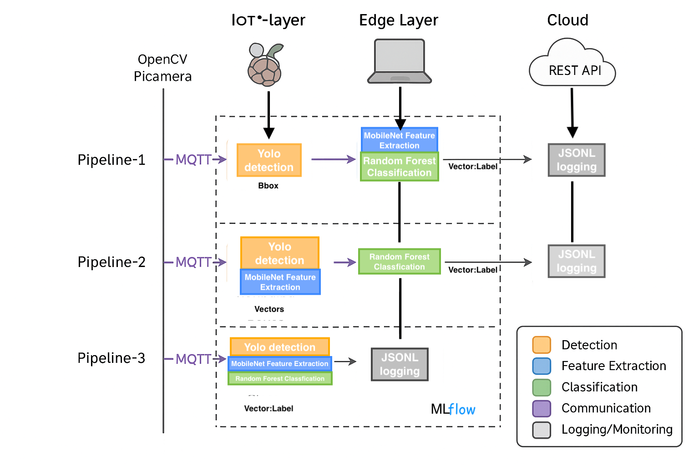
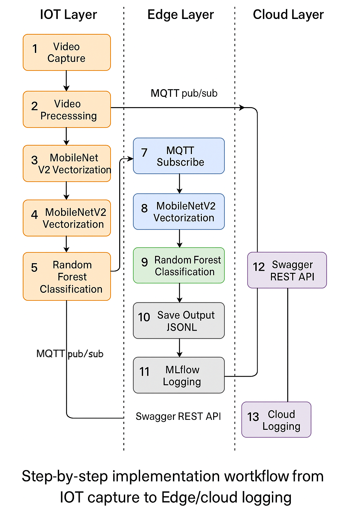
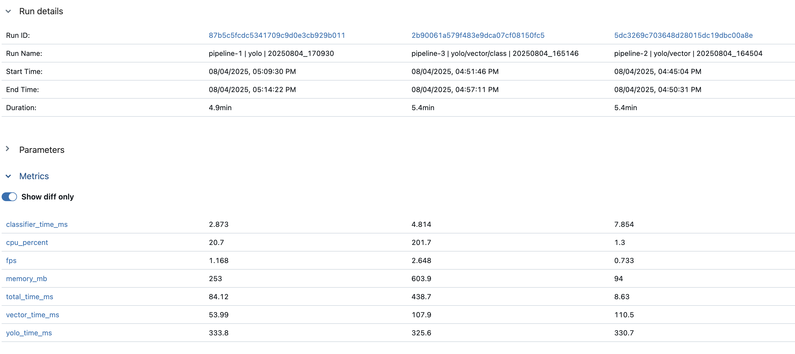
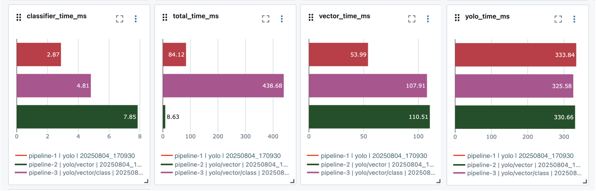
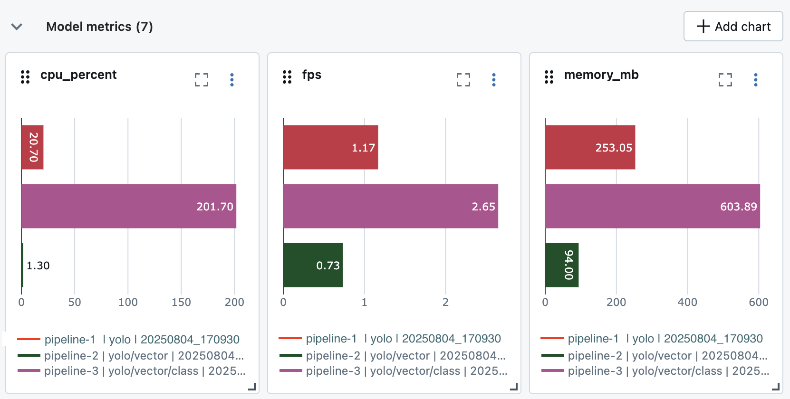

# IoT–Edge AI Pipeline Benchmarking (YOLOv8n + MobileNetV2 + Random Forest)

A real-time IoT–Edge AI system designed and benchmarked to evaluate **latency, throughput, and resource efficiency** across different pipeline architectures using **YOLOv8n, MobileNetV2, and Random Forest**.

This project implements and compares **three distributed AI pipelines** across **Raspberry Pi (IoT)** and **Edge (MacBook)** environments using **MQTT-based communication** and **MLflow-driven benchmarking**.

---

## Problem Statement

Real-time computer vision in IoT environments is constrained by:

- Limited CPU & memory (Raspberry Pi)
- Network bandwidth constraints
- Latency requirements for real-time decisions

Most systems optimise **models in isolation**, but fail to evaluate:

❌ End-to-end pipeline performance  
❌ Task distribution between IoT vs Edge  
❌ Real-world trade-offs (FPS vs CPU vs latency)

---

## Solution Overview

This project designs and benchmarks **three IoT–Edge pipeline architectures**:

### 🔹 Pipeline 1 (Balanced Architecture)
- IoT: YOLOv8n (object detection)
- Edge: MobileNetV2 (vectorisation) + Random Forest (classification)

### 🔹 Pipeline 2 (IoT-heavy Vectorisation)
- IoT: YOLOv8n + MobileNetV2
- Edge: Random Forest

### 🔹 Pipeline 3 (Fully IoT Execution)
- IoT: YOLOv8n + MobileNetV2 + Random Forest
- Edge: Logging only

---

## System Architecture



👉 This diagram shows how computation is distributed between IoT and Edge layers.  
👉 MQTT enables asynchronous communication between components.  
👉 Each pipeline shifts workload across layers to evaluate performance trade-offs.

---

## End-to-End Workflow



📌 Key Flow:
1. Image captured on Raspberry Pi  
2. YOLO performs object detection  
3. Features extracted (MobileNetV2)  
4. Classification performed (Random Forest)  
5. Results logged and tracked via MLflow  

---

## Data Flow

### Pipeline 1:
Image → YOLO (IoT) → Bounding Boxes → MQTT → Edge → Vector → Classification

### Pipeline 2:
Image → YOLO + Vector (IoT) → MQTT → Edge → Classification

### Pipeline 3:
Image → Full Pipeline (IoT) → MQTT → Edge (Logging only)

---

## Benchmarking Metrics (MLflow)

The system tracks:

- `yolo_time_ms`
- `vector_time_ms`
- `classifier_time_ms`
- `total_time_ms`
- `fps`
- `cpu_percent`
- `memory_mb`

---

## Performance Analysis

### 🔹 MLflow Dashboard Comparison


👉 Shows all pipelines under identical conditions  
👉 Enables reproducible benchmarking  

---

### 🔹 Trade-off: Latency per Stage


📌 Insights:
- Pipeline 1 → fastest total latency (~84ms)
- Pipeline 3 → fastest YOLO but slow overall

---

### 🔹 Trade-off: FPS vs CPU


📌 Insights:
- Pipeline 3 → highest FPS but unsustainable CPU
- Pipeline 2 → lowest CPU but poor FPS
- Pipeline 1 → balanced

---

## Key Results

| Metric              | Pipeline 1 ✅ | Pipeline 2 ⚠️ | Pipeline 3 ⚡ |
|--------------------|-------------|--------------|--------------|
| Total Time         | **84 ms** (best) | 438 ms | Slow |
| FPS                | Balanced     | Low          | Highest      |
| CPU Usage          | Moderate     | Low          | Very High    |
| Memory             | Moderate     | Low          | High         |

---

## Final Outcome

👉 **Pipeline 1 is the optimal architecture**

✔ Balanced latency + FPS  
✔ Sustainable CPU usage  
✔ Scalable for real-world deployment  

---

## Tech Stack

| Category        | Technology |
|----------------|-----------|
| AI Models       | YOLOv8n, MobileNetV2, Random Forest |
| IoT Hardware    | Raspberry Pi 5 + Pi Camera |
| Communication   | MQTT (Mosquitto) |
| Backend API     | FastAPI |
| MLOps           | MLflow |
| Data Processing | NumPy, OpenCV |
| ML Libraries    | Scikit-learn |
| Visualization   | Matplotlib |
| Language        | Python |

---

## Project Structure
RPiPipeline/
│
├── app_server.py              # FastAPI server
├── vector_inference.json
├── requirements.txt
│
├── yolo/
│   ├── Edge layer/
│   │   ├── edge_sub.py
│   │   ├── mobilenet_vectorizer.py
│   │   └── mqtt_visualizer.py
│   │
│   ├── IoT layer/
│   │   ├── iot_y_pub.py
│   │   └── yolov8n.pt
│
├── yolo-mobilenet/
│   ├── IoT layer/
│   │   ├── iot_yv_pub.py
│   │   └── mobilenet_vectorizer.py
│
├── yolo-mobilenet-classifier/
│   ├── IoT layer/
│   │   ├── iot_yvc_pub.py
│   │   └── faceM.joblib

---

## How to Run

### 1. Install dependencies
```bash
pip install -r requirements.txt

2. Start MQTT Broker
mosquitto

3. Run IoT Pipeline
python iot_y_pub.py

4. Run Edge Subscriber
python edge_sub.py

5. Start API
uvicorn app_server:app --reload


⸻

☁️ MLflow Tracking

mlflow ui
Access at:
http://127.0.0.1:5000


---

## 💡 Key Learnings
    •   Task partitioning is more impactful than model choice
    •   Edge offloading significantly reduces IoT overload
    •   MQTT enables scalable, decoupled architectures
    •   MLflow ensures reproducible benchmarking

---

## 🔮 Future Improvements
    •   Model quantisation & pruning
    •   Multi-device IoT scaling
    •   Cloud integration (AWS/GCP)
    •   Real-time streaming pipelines

---

## 🧑‍💻 Author

Samuel Sathiyamoorthy
MSc Cloud Computing – Newcastle University
ssamuelpillai@gmail.com
